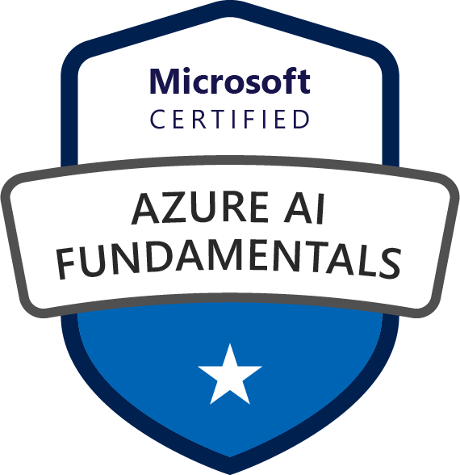
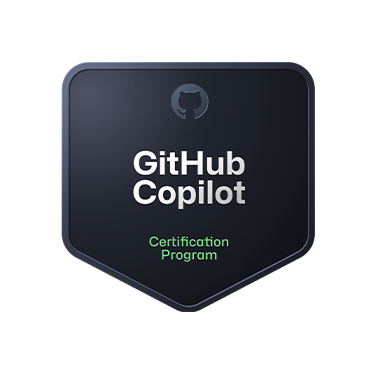
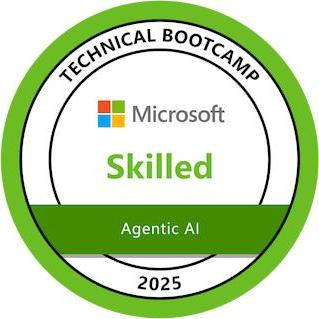
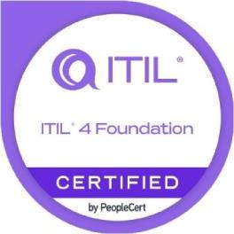

# Hi 👋, I'm Manish Kumar

  <b>Azure Cloud Architect • FinOps Consultant • Site Reliability & DevOps Engineer</b>

---

## 🚀 About Me

I am an **Azure Cloud Architect** and **FinOps Consultant** with over **14 years of experience** building, operating, and optimizing enterprise-scale cloud environments. I specialize in cloud governance, cost management, infrastructure automation, and Site Reliability Engineering (SRE) practices.

* 💸 **FinOps Champion:** Consistently delivering 20–30% cloud cost reductions through governance and cost-management frameworks.
* 🤖 **Automation Advocate:** Reducing MTTR by ~25% using AI-powered automation and robust observability tools.
* 🏗️ **IaC Specialist:** Scaling robust delivery models with Terraform, ARM Templates, and CI/CD pipelines.

---

## 🛠️ Tech Stack & Tooling

  

### ☁️ Specialized Capabilities
* 🐳 **Containers & Compute:** Azure Kubernetes Service (AKS), Hyper-V
* ⚙️ **Serverless & Integration:** Azure Functions, Logic Apps
* 🏗️ **IaC & CI/CD Pipelines:** Azure DevOps, ARM Templates, Bicep
* 🛡️ **Governance & Security:** Azure Policy, Azure RBAC, Microsoft Entra ID, Defender for Cloud
* 📊 **Operations & SRE:** Observability & SRE, Incident Management (PagerDuty)

---

## 🔎 Featured Projects

* 🧠 **AI-Powered Incident Management System**
  Intelligent SRE incident management using Azure Functions & Service Bus. Integrated with monitoring and alerting, reducing MTTR by **~25%**.
  [*Explore Project ↗*](https://github.com/kumammanish)
  
* 💰 **FinOps Cost Optimization Framework**
  Azure Cost Management integration coupled with PowerShell automation, enabling structured governance and resource right-sizing to deliver **20–30% cost savings**.
  
* 🏗️ **Enterprise Azure IaC Templates**
  Reusable Terraform/ARM template libraries featuring automated validation, policy compliance checks, and secure multi-stage environments.
  
* 📰 **AI News Console**
  A sample web-based console utilized for testing CI/CD validation and automated runs.
  [*Explore Repo ↗*](https://github.com/kumammanish/ai-news-console)

---

## 🏅 Certifications

  
  
  
  
  
  
  
  
  
  

---

## 📊 GitHub Stats

  
  &nbsp;&nbsp;
  

---

## 📫 Connect with Me

  
  
  
  

*This README was updated to remove redundancies and optimize layout presentation.*
